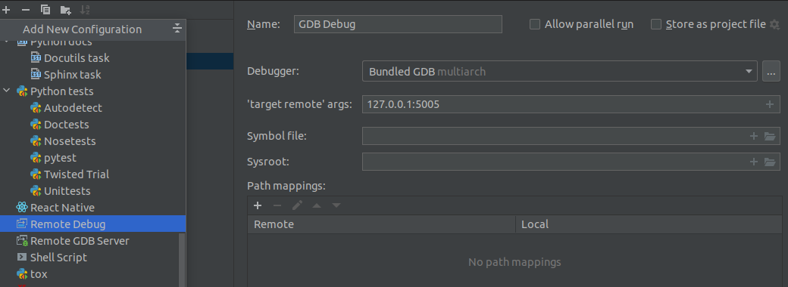

Developer Documentation
=======================

Variable names
--------------

Use `snake_case` for all variables. In addition, for preprocessor constants and
enum members we use capital letters.

Braces
------

Omit the braces for a block if it has only a single statement. For example, `if`
with a single statement in the body, or `for` with a single statement in the
body.  Keep braces in the following `for` loop (even if they can be omitted
without any change to program logic) since it has two lines in the body

.. code-block:: c

    for (unsigned i = 0; i < 10; i++) {
      if (i < 5)
        printf("i < 5");
    }

Also, in an `if-then-else` block, if at least one branch has more than one
statement in the body, use braces for all the branches like below

.. code-block:: c

    if (a < 5) {
      printf("a < 5");
    } else if (a == 5) {
      printf("a == 5");
    } else {
      b = a;
      printf("a > 5");
    }

instead of

.. code-block:: c

    if (a < 5)
      printf("a < 5");
    else if (a == 5)
      printf("a == 5");
    else {
      b = a;
      printf("a > 5");
    }

Formatting files before committing
----------------------------------

Run `clang-format` before committing any changes you make on the source files.
`clang-format` will be available if you install the dev dependencies with conda.
Run `clang-format` as follows

.. code-block:: bash

    clang-format -i **/*.[ch]

If you change any python files, please use `black` and `isort` to format the
python code and then check with `flake8` before committing. `black`, `isort`
and `flake8`  will be available if you install the dev dependencies with
conda

.. code-block:: bash

    black **/*.py; isort **/*.py
    flake8

Debugging github actions
------------------------

`tmate` can be used to `ssh` into a github runner instance when the workflow is
launched manually from github.

Select the relevant workflow under `Actions` tab and then click `run workflow`
button and select run with `tmate`. This will run `tmate` action in the very
beginning of the selected workflow and you will see a `ssh` address that can
be used to connect to the runner instance.

Once connected to the runner instance, to continue the rest of the workflow
type the following in the `libnomp` project directory

.. code-block:: bash

    touch continue

Then the workflow will continue and you can monitor the progress on GitHub.
If the workflow fails at some point, you can use the session you are connected
for debugging. Session will be kept alive for 30 minutes after failure.

More info on tmate can be found [here](https://mxschmitt.github.io/action-tmate/).

Debugging libnomp tests
------------------------
After installing libnomp, you can debug the test cases using the `lnrun` script.
As a prerequisite you have to install the `gdbserver` which you can install with,

.. code-block:: bash

    sudo apt install gdbserver

Use :code:`lnrun debug` command to host the debugging session. If you want to debug the
test case `nomp-api-200`,

.. code-block:: bash

    lnrun debug 200

Additionally, you can set the port and the target device for the specific session.
You can view the available options by :code:`lnrun -h debug`.

By default the test starts on `localhost:5005`, and a debug viewer should be connected
to this target address. For example, the following figure shows how clion connects to
the test case using remote debug.

