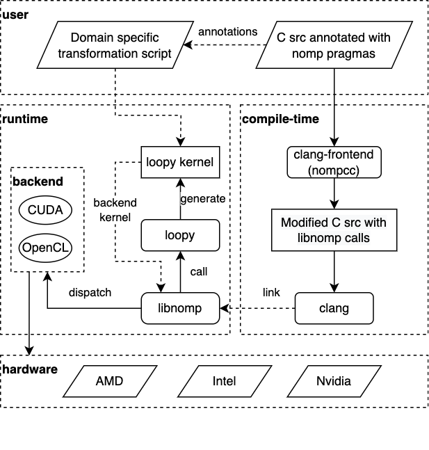

Introduction
============

nomp: A Framework For Creating Domain Specific Compilers For C
--------------------------------------------------------------

`nomp` (Originally a recursive acronym: "Nomp isn't OpenMP") is a framework
for creating domain specific compilers and a runtime or C programming language
that can be used to program accelerators (GPUs, CPUs, etc.) easily and
efficiently.

`nomp` consists of two main components: `nompcc`_ and `libnomp`_. `nompcc`
is the `clang`_ based compiler frontend which pre-process and compile C
source files. `libnomp` is the `loopy`_ based runtime which can generate and
tune accelerator code (i.e., kernels) from C source at runtime and then
perform low level dispatch to accelerators using other high performing
programming models (or backends) like OpenCL, and CUDA.

`nomp` uses pragmas to annotate C source with meta information about which
sections of C source must be executed on accelerators. Also, pragmas can be
used to perform data transfers between host (most often a CPU) and accelerators
(most often a GPU). `nompcc` converts these pragmas to `libnomp` runtime calls
and compile and link source code against `libnomp` at compile time. Then at
runtime, based on runtime calls, `libnomp` will perform kernel generation,
transformation, and execution on accelerators using `loopy` and other low
level backends.

Instead of acting solely based on pragmas, `nomp` can consume a user written
domain and/or kernel specific transformation scripts (written in Python using
`loopy` API) at runtime. This gives users more control over kernel generation
and execution. These external scripts don't require any changes in original C
source and can be customized and/or changed without recompiling user program.
`nomp` also passes a dictionary to the transformations functions defined in
these user scripts with information about the target accelerator and other 
relevant information that could help in finding optimal kernel transformations.

`loopy`_ is a code generator for array based code on accelerators. In contrast
to mainstream programming models like OpenCL, CUDA, etc., which force users
to make implementation choices at program logic level, `loopy` separates
program logic from implementation details. For example, all afore-mentioned
programming models force users to decide memory location for arrays (shared
memory vs global memory vs registers) and mapping of loops to hardware axes
at compile time. `loopy` provides an API for users to experiment and tune
these details at runtime and thus provides a more portable way of writing
kernels.

`nomp` architecture diagram which shows the main components and workflow is
shown in the following figure.

`nomp` combines unique features available across several mainstream programming
models for programming accelerators and complement them with `loopy`. `nomp` is:

#. **Easy to use** since it uses a simple pragma based syntax like OpenMP.
#. **High performant** since it uses high performant programming models like
   OpenCL, CUDA, etc. for running the kernels on accelerators.
#. **Portable** since it uses `loopy` to separate algorithm and its final
   schedule on hardware. This gives users (i.e., a performance engineer) an
   opportunity to optimize kernels based on problem input and/or target hardware
   it will be executed on.
#. **External** to source code since its pragma based and uses external
   transformation scripts. `nomp` pragmas are designed to be discarded if necessary
   (without making any changes to the source code) and the C source code will work
   as expected on the CPU.
#. **Customizable** to each domain since it lets users reuse domain specific
   programming patterns using user defined set of `annotations`.

.. toctree::
   :maxdepth: 3
   :caption: Table of Contents

   self
   build
   examples
   user-api
   internal-api
   developer-docs

Indices and tables
==================

* :ref:`genindex`
* :ref:`search`

.. _nompcc: https://github.com/nomp-org/llvm-project/
.. _libnomp: https://github.com/nomp-org/libnomp/
.. _loopy: https://documen.tician.de/loopy/
.. _clang: https://clang.llvm.org/
